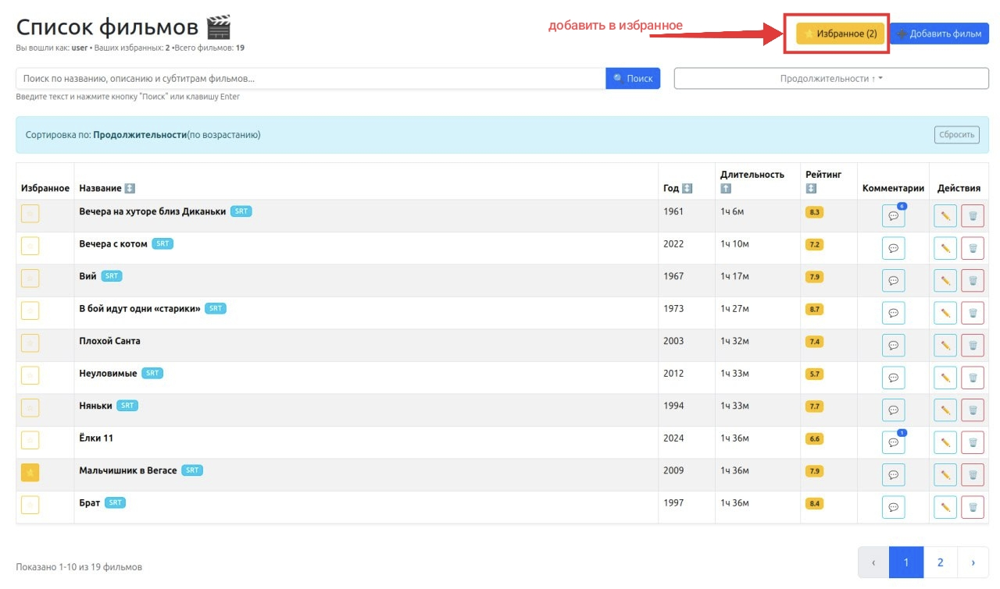
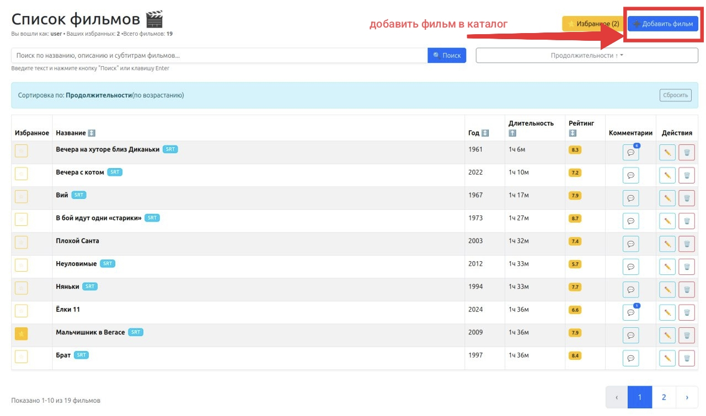
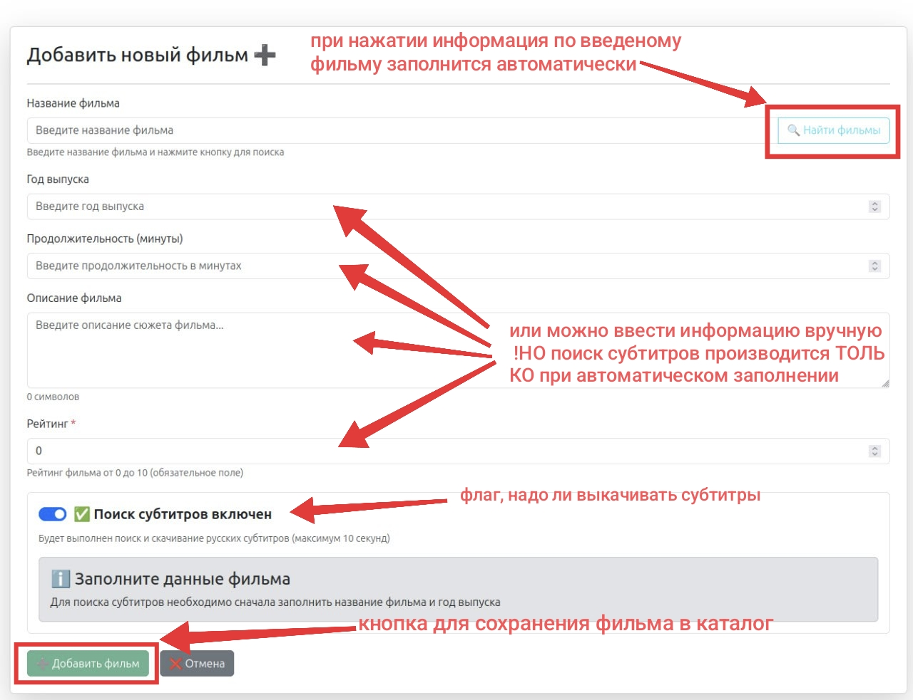
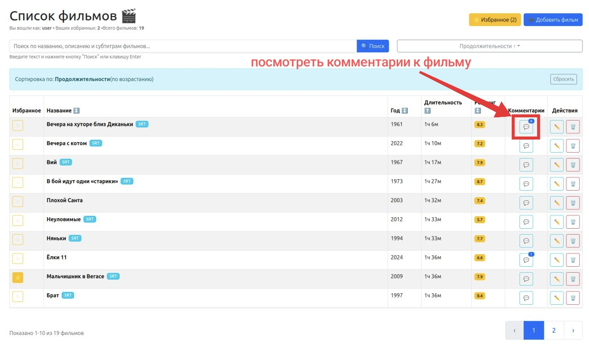
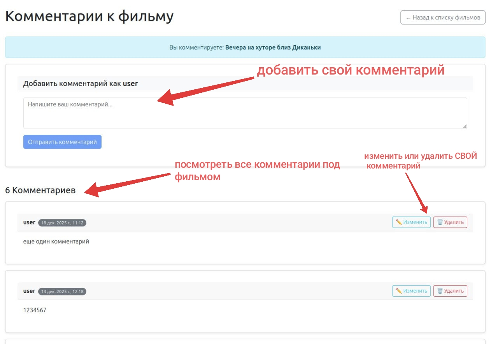
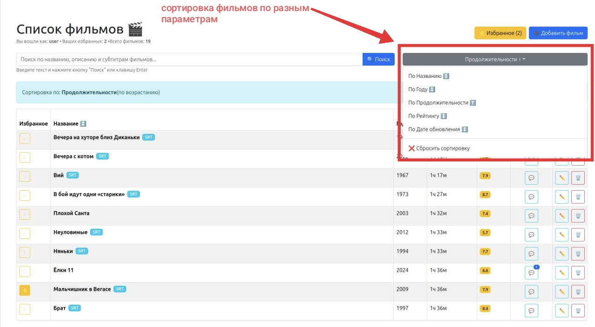
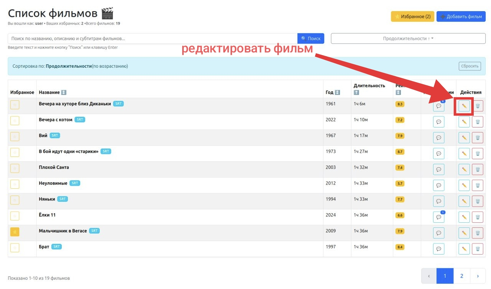
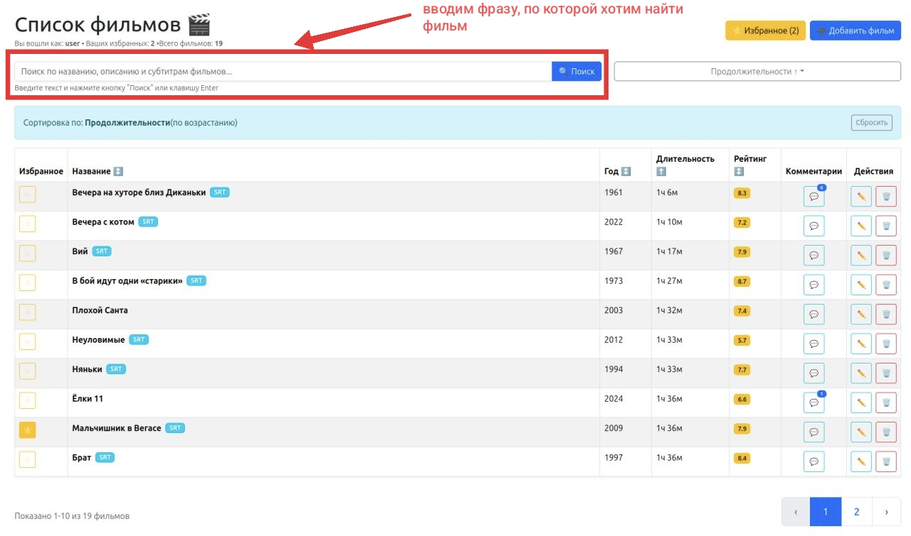
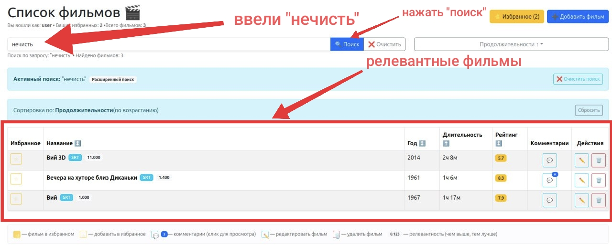

## Проект представляет собой кинотеку с полнотекстовып поиском по названию, описанию и субтитрам (если есть)
Поиск реализован средствами postgres

В проекте используется api kinopoisk и opensubtitles(не всегда работает из России)

## Как получить исходники 
git clone https://github.com/AliceG32/project_frontend_movies.git

## Требования

Node.js 20

БД: postgresql

## Запуск

npm install (может понадобится флаг --legacy-peer-deps)

src/config/api-dist.ts - ключи изменяем на свои данные и переименовываем в api.ts

как открыть приложение: 
1) npm run dev
2) http://localhost:5173/

## Сборка

### npm run build 
Сайт собирается в папку dist

ссылка на GitHub Pages: https://aliceg32.github.io/project_frontend_movies/

##  Тесты

### npm test
Unit тесты

### npm run test:e2e
e2e тесты

### npm run test-storybook
Storybook тесты

### Скриншоты выполнения тестов находятся в папке tests_screenshots

## Структура проекта

src - папка с исходным кодом

src/pages - код основных страниц и тесты StoryBook

src/redux - слайсы Redux + unit-тесты redux

docs - собранный проект для github pages

tests - папка End-to-End тесты

## Основные кейсы

❗ Создано 2 пользователя с логином и паролем, регистрации нет. 
Два пользователя созданы для того чтобы продемонстрировать, 
что один пользователь может редактировать и удалять только свои комментарии под фильмом, чужие - нет

Чтобы в этом убедиться, посмотрите комментарии к фильму "Вечера на хуторе близ Диканьки"

Продемонстрируем основные кейсы через скриншоты с указателями
### Добавить в избранное

### Добавить фильм в каталог

После нажатия кнопки "добавить фильм" откроется окно.
Можно заполнить поля автоматически или вручную

### Посмотреть комментарии

После нажатия кнопки со значком комментария откроется окно.
Можно добавить свой комментарий, удалить или отредактировать.
А также посмотреть комментарии других пользователей.

### Сортировка фильмов по разным параметрам

### Редактирование фильма

После нажатия кнопки для редактированияя откроется окно,
где можно изменить параметры фильмы

### ✅ ФИЧА

## Можно ввести фразу или какое-то слово, на основе чего будут найдены релевантные фильмы
Поиск производится по названию и субтирам.

❗ Так как база нашего каталога мала, то большинство фраз будут не найдены. 
Поэтому мы предлагаем следующие фразы для тестирования поиска: 
1. нечисть
2. война
3. меч
4. двое мужчин

